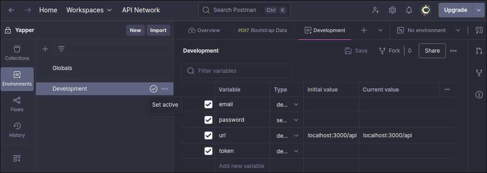
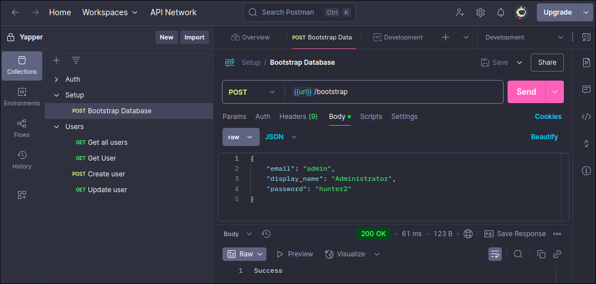

# Getting Started

## 1. Pre-requisites
- [Golang](https://go.dev/doc/install)
- [Goose](https://github.com/pressly/goose)

You will also need to install Docker and Docker Compose for development.
### Arch Linux
```sh
sudo pacman -S docker docker-compose
```

Then enable `docker.service`
```sh
systemctl enable docker.service
```

Then add the user to the docker group so you can run `docker compose`
```sh
sudo groupadd docker
sudo usermod -aG docker $USER
```

Reboot the computer

## 2. Running the server and database
Copy the `.env.example` file and change the values to what you want
```sh
cp .env.example .env
```

The web app can now be accessed at localhost:$SERVER_PORT

Run docker compose
```sh
docker compose up
```

## 3. Setting up the database
Once the database is spun up for the first time, it will be empty. It can be setup by use make:
```sh
make db-setup
```

## 4. Bootstrap the database with Postman
If you try and login, you will see that it will always say email and password is incorrect. This is because
we need to set up the database to have one account at least. This can be done by sending a POST request to the endpoint
localhost:$SERVER_PORT/api/bootstrap with the following body:
```json
{
    "email": "admin@admin.com",
    "display_name": "Administrator",
    "password": "hunter2"
}
```

Choose any values you would like for this. I prefer to use Postman to do this.

First set up the environment variables needed. I like to make it in the Development scope (remember to press the tick to make it active)



Then send the POST request



## 5. Connecting to the database directly
You can connect to the database to run SQL commands directly by using the psql application.
### Arch Linux
```sh
sudo pacman -S postgresql
```

You can then connect with
```sh
make db-connect
```

## 6. Done
You should now be able to log in to the app with the credentials you just created
